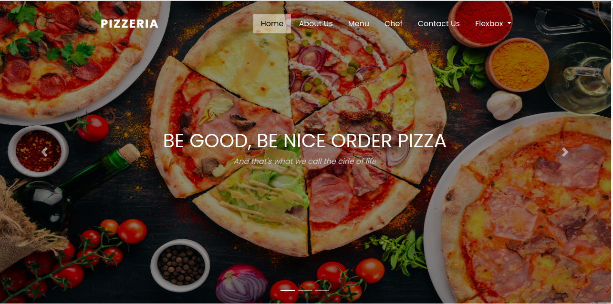

# THE NEIGHBOURHOOD PIZZERIA

## Description
This is a pizza delivery web-app that allows a user to order his/her choice of pizza, size and any extra toppings if needed. He will then input his contact details and the app will give him the total cost of the order. Upon that, he will receive a notification confirming his order and time for delivery.

## Behaviour Driven Development
| Behaviour | Input |  Output |
| ----------- | ----------- | ----------- |
| Select pizza flavor | Sunchoke Pizza | Sunchoke Pizza |
| Select piza size | large, medium, small | small |
| Select Crust| Either cripsy,stuffed or glutten-free |   |
| Select Toppings |  | check all the topppings you would want |
| Press Proceed button |  | Table of your selections with the total price for the selection you've selected.|
| Press add pizza button | pizza flavor,size, crust and toppings | new selection added to the table|
|Press Checkout |  | checkouts your total bill |
| Press home delivery| Your name, phone number and delivery location |  |
| Press Place Order| | We have recieved your order and it will be delivered to you with your name, place of delivery, time that will take  and amount to be paid on delivery.  |
| |  |   |

## Setup Instruction
## First Method
1. In the terminal Navigate to the directory you want the project to reside in e.g (cd-/Desktop)

2. Clone the project (https://github.com/Annewangari/The-Neighborhood-Pizzeria)

3. Navigate into the created folder (cd-The-Neighborhood-Pizzeria)

4. Open the project with vscode (code .)

## Second Method
1. Download the Project's zip files

2. Extract it to the folder of your choice

3. In a text editor open the project's folder

# Project screenshot

# Project Figma Link
https://www.figma.com/file/5LNGp01RS4RISn0GFxIzZJ/Untitled?node-id=0%3A1

# Technology Used
HTML5

CSS

Bootstrap

jQuery

markdown

# Contact
Incase of any question, feedback or contribution, kindly reach out to me via.

Email

annekare3@gmail.com
 
 Phone Number

 +254704326658

# Athour

 Anne Wangari Mwangi

 # Lincense

[MIT](https://github.com/Annewangari/The-Neighborhood-Pizzeria/blob/master/LICENSE)

 Copyright (c) 2020 Annewangari